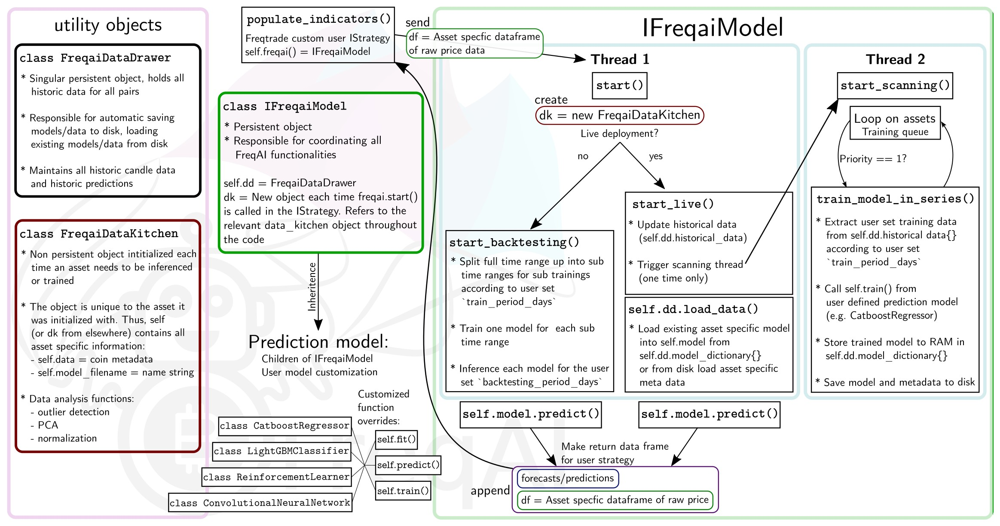

# 开发

## 项目架构

FreqAI的架构和功能经过通用化设计，以鼓励开发独特的功能、函数、模型等。

类结构和详细的算法概述如下图所示：

如图所示，FreqAI由三个不同的对象组成：

* **IFreqaiModel** - 一个单一的持久化对象，包含收集、存储和处理数据、特征工程、运行训练以及模型推理所需的所有逻辑。
* **FreqaiDataKitchen** - 一个非持久化对象，为每个独特的资产/模型单独创建。除了元数据外，它还包含各种数据处理工具。
* **FreqaiDataDrawer** - 一个单一的持久化对象，包含所有历史预测、模型以及保存/加载方法。

有多种内置的[预测模型](freqai-configuration.md#using-different-prediction-models)直接继承自`IFreqaiModel`。这些模型中的每一个都可以完全访问`IFreqaiModel`中的所有方法，因此可以随意重写其中任何函数。不过，高级用户可能会坚持重写`fit()`、`train()`、`predict()`以及`data_cleaning_train/predict()`。

## 数据处理

FreqAI旨在以简化后处理并通过自动数据重载增强崩溃恢复能力的方式组织模型文件、预测数据和元数据。数据保存在`user_data_dir/models/`文件结构中，该结构包含所有与训练和回测相关的数据。`FreqaiDataKitchen()`严重依赖此文件结构进行正确的训练和推理，因此不应手动修改。

### 文件结构

文件结构根据[配置](freqai-configuration.md#setting-up-the-configuration-file)中设置的模型`identifier`自动生成。以下结构显示了用于后处理的数据存储位置：

| 结构 | 描述 |
|-----------|-------------|
| `config_*.json` | 模型特定配置文件的副本。 |
| `historic_predictions.pkl` | 包含在实盘部署期间`identifier`模型生命周期内生成的所有历史预测的文件。`historic_predictions.pkl`用于在崩溃或配置更改后重新加载模型。主文件始终有一个备份文件，以防损坏。FreqAI **自动**检测损坏并使用备份替换损坏的文件。 |
| `pair_dictionary.json` | 包含训练队列以及最近训练模型的磁盘位置的文件。 |
| `sub-train-*_TIMESTAMP` | 包含与单个模型相关的所有文件的文件夹，例如：  || `*_metadata.json` - 模型的元数据，例如归一化最大值/最小值、预期训练特征列表等。  || `*_model.*` - 保存到磁盘的模型文件，用于从崩溃中重新加载。可以是`joblib`（典型的 boosting 库）、`zip`（stable_baselines）、`hd5`（keras 类型）等。  || `*_pca_object.pkl` - [主成分分析（PCA）](freqai-feature-engineering.md#data-dimensionality-reduction-with-principal-component-analysis)变换（如果在配置中设置了`principal_component_analysis: True`），用于变换未见过的预测特征。  || `*_svm_model.pkl` - [支持向量机（SVM）](freqai-feature-engineering.md#identifying-outliers-using-a-support-vector-machine-svm)模型（如果在配置中设置了`use_SVM_to_remove_outliers: True`），用于检测未见过的预测特征中的异常值。  || `*_trained_df.pkl` - 包含用于训练`identifier`模型的所有训练特征的数据框。用于计算[不相似性指数（DI）](freqai-feature-engineering.md#identifying-outliers-with-the-dissimilarity-index-di)，也可用于后处理。  || `*_trained_dates.df.pkl` - 与`trained_df.pkl`关联的日期，对后处理有用。 |

示例文件结构如下所示：