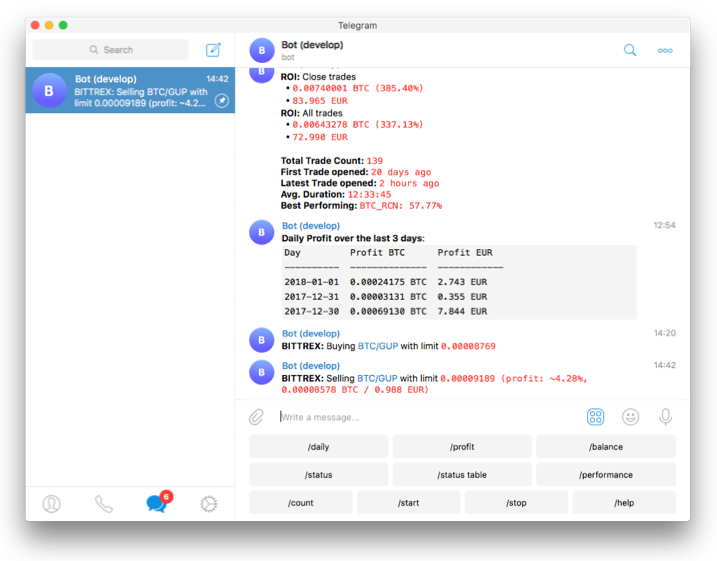

<!-- GitHub action buttons -->
[:octicons-star-16: 收藏](https://github.com/freqtrade/freqtrade){ .md-button .md-button--sm }
[:octicons-repo-forked-16: 分叉](https://github.com/freqtrade/freqtrade/fork){ .md-button .md-button--sm }
[:octicons-download-16: 下载](https://github.com/freqtrade/freqtrade/archive/stable.zip){ .md-button .md-button--sm }

## 简介

Freqtrade 是一个免费开源的加密货币交易机器人，用 Python 编写。它旨在支持所有主要交易所，并可通过 Telegram 或 webUI 进行控制。它包含回测、绘图和资金管理工具，以及通过机器学习进行策略优化的功能。

!!! Danger "免责声明"
    本软件仅用于教育目的。不要用你害怕损失的钱去冒险。使用本软件的风险由你自行承担。作者及所有关联方对你的交易结果不承担任何责任。

    始终先以模拟运行（Dry-run）模式运行交易机器人，在你了解它的工作原理以及预期的盈亏之前，不要投入资金。

    我们强烈建议你具备基本的编码技能和 Python 知识。不要犹豫阅读源代码，了解这个机器人的机制、算法和实现的技术。

## 功能特性

- 开发你的策略：用 Python 编写策略，使用 [pandas](https://pandas.pydata.org/)。策略库 [strategy repository](https://github.com/freqtrade/freqtrade-strategies) 中提供了可启发你的示例策略。
- 下载市场数据：下载交易所的历史数据以及你可能想要交易的市场数据。
- 回测：在下载的历史数据上测试你的策略。
- 优化：使用采用机器学习方法的超参数优化，为你的策略找到最佳参数。你可以优化策略的买入、卖出、止盈（ROI）、止损和追踪止损参数。
- 选择交易市场：创建静态列表或使用基于交易量和/或价格排名的自动列表（回测期间不可用）。你也可以明确将不想交易的市场加入黑名单。
- 运行：用模拟资金测试你的策略（模拟运行模式）或用真实资金部署（实盘交易模式）。
- 控制/监控：使用 Telegram 或 WebUI（启动/停止机器人、显示盈亏、每日总结、当前未平仓交易结果等）。
- 分析：可对回测数据或 Freqtrade 交易历史（SQL 数据库）进行进一步分析，包括自动生成标准图表，以及将数据加载到 [交互式环境](data-analysis.md) 的方法。

## 支持的交易所市场

请阅读 [交易所特定说明](exchanges.md)，了解每个交易所可能需要的特殊配置。

- [X] [Binance](https://www.binance.com/)
- [X] [BingX](https://bingx.com/invite/0EM9RX)
- [X] [Bitmart](https://bitmart.com/)
- [X] [Bybit](https://bybit.com/)
- [X] [Gate.io](https://www.gate.io/ref/6266643)
- [X] [HTX](https://www.htx.com/)
- [X] [Hyperliquid](https://hyperliquid.xyz/)（去中心化交易所，即 DEX）
- [X] [Kraken](https://kraken.com/)
- [X] [OKX](https://okx.com/)
- [X] [MyOKX](https://okx.com/)（OKX 欧洲经济区版）
- [ ] [通过  可能支持许多其他交易所](https://github.com/ccxt/ccxt/)。_（我们不能保证它们都能正常工作）_

### 支持的期货交易所（实验性）

- [X] [Binance](https://www.binance.com/)
- [X] [Bybit](https://bybit.com/)
- [X] [Gate.io](https://www.gate.io/ref/6266643)
- [X] [Hyperliquid](https://hyperliquid.xyz/)（去中心化交易所，即 DEX）
- [X] [OKX](https://okx.com/)

请务必在开始前阅读 [交易所特定说明](exchanges.md) 以及 [杠杆交易](leverage.md) 文档。

### 社区测试通过

社区确认可正常工作的交易所：

- [X] [Bitvavo](https://bitvavo.com/)
- [X] [Kucoin](https://www.kucoin.com/)

## 社区展示

--8<-- "includes/showcase.md"

## 系统要求

### 硬件要求

运行此机器人，我们建议你使用 Linux 云服务器实例，最低配置为：

- 2GB 内存
- 1GB 磁盘空间
- 2 核 vCPU

### 软件要求

- Docker（推荐）

或者

- Python 3.10+
- pip (pip3)
- git
- TA-Lib
- virtualenv（推荐）

## 支持

### 帮助 / Discord

对于文档未涵盖的任何问题，或需要了解有关机器人的更多信息，或只是想与志同道合的人交流，我们鼓励你加入 Freqtrade [Discord 服务器](https://discord.gg/p7nuUNVfP7)。

## 准备好尝试了吗？

首先阅读安装指南 [Docker 版](docker_quickstart.md)（推荐），或 [无 Docker 安装版](installation.md)。